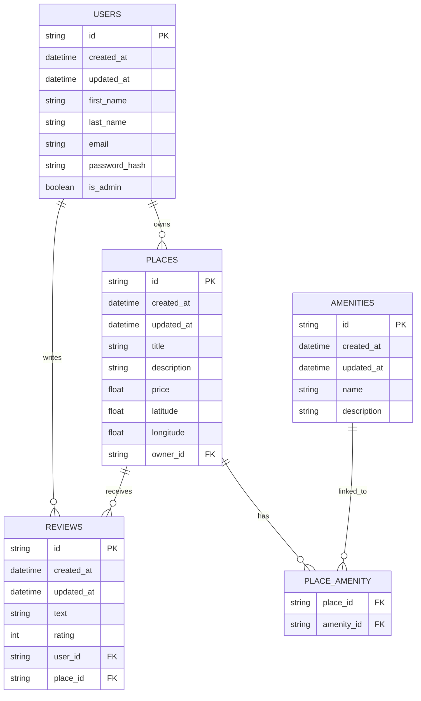

```mermaid
erDiagram
    USERS {
        string id PK
        datetime created_at
        datetime updated_at
        string first_name
        string last_name
        string email
        string password_hash
        boolean is_admin
    }

    PLACES {
        string id PK
        datetime created_at
        datetime updated_at
        string title
        string description
        float price
        float latitude
        float longitude
        string owner_id FK
    }

    REVIEWS {
        string id PK
        datetime created_at
        datetime updated_at
        string text
        int rating
        string user_id FK
        string place_id FK
    }

    AMENITIES {
        string id PK
        datetime created_at
        datetime updated_at
        string name
        string description
    }

    PLACE_AMENITY {
        string place_id FK
        string amenity_id FK
    }

    USERS ||--o{ PLACES : owns
    USERS ||--o{ REVIEWS : writes
    PLACES ||--o{ REVIEWS : receives
    PLACES ||--o{ PLACE_AMENITY : has
    AMENITIES ||--o{ PLACE_AMENITY : linked_to

```
